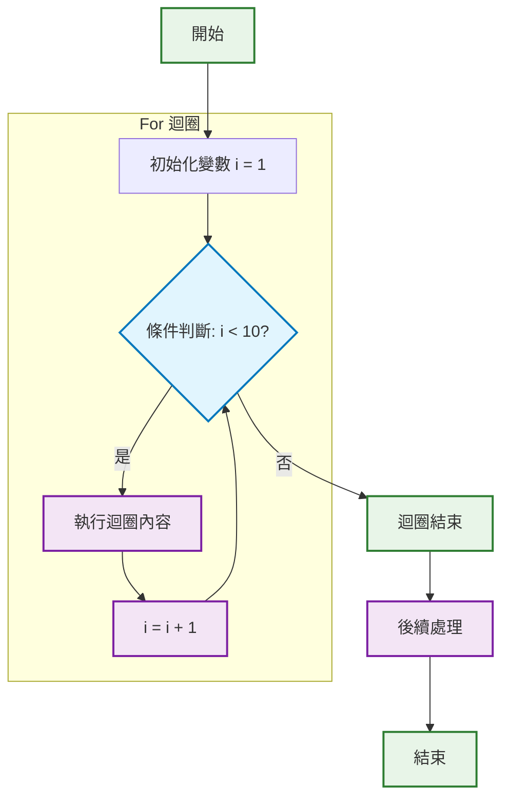
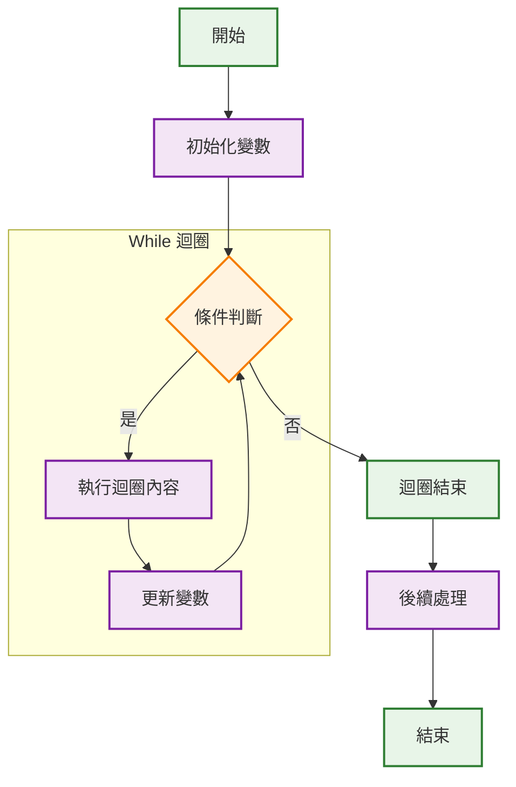

# 流程圖說明文件

## 目的

為 doc 資料夾中的現有 Markdown 文件添加 Mermaid 風格的流程圖，幫助初學 C# 程式設計的學生更好地理解程式邏輯。

## 修改步驟

1. 開啟 doc 資料夾中的 Markdown 文件，例如 StringReplace.md。
2. 在文件中的適當位置，例如在題目說明之後，加入流程圖區塊。
3. 使用 Mermaid 語法來描述流程圖，語法如下：
   - 開始節點使用 start 關鍵字。
   - 結束節點使用 end 關鍵字。
   - 條件判斷使用 if 關鍵字，後跟條件描述。
   - 流程使用箭頭連接，例如 A 指向 B 使用 A --> B。
   - 輸出或動作使用方框表示。

## For 迴圈流程圖範例

當程式中包含 for 迴圈時，可以參考以下標準流程圖格式：



## While 迴圈流程圖範例

當程式中包含 while 迴圈時，可以參考以下標準流程圖格式：



## 範例流程圖

針對 StringReplace.md 中的程式邏輯，可以添加以下流程圖：

```
flowchart TD
    A[開始] --> B[初始化變數 i = 1]
    B --> C{條件判斷: i <= 100?}
    C -->|是| D{i 是 2 和 3 的倍數嗎？}
    D -->|是| E[輸出 金槍魚]
    D -->|否| F{i 是 2 的倍數嗎？}
    F -->|是| G[輸出 螃蟹]
    F -->|否| H{i 是 3 的倍數嗎？}
    H -->|是| I[輸出 章魚]
    H -->|否| J[輸出 i]
    E --> K[i = i + 1]
    G --> K
    I --> K
    J --> K
    K --> C
    C -->|否| L[迴圈結束]
    L --> M[結束]

    subgraph "For 迴圈"
        B
        C
        D
        E
        F
        G
        H
        I
        J
        K
    end

    %% 樣式設定
    classDef condition fill:#e1f5fe,stroke:#0277bd,stroke-width:2px
    classDef process fill:#f3e5f5,stroke:#7b1fa2,stroke-width:2px
    classDef terminal fill:#e8f5e8,stroke:#2e7d32,stroke-width:2px

    class C,D,F,H condition
    class E,G,I,J,K process
    class A,L,M terminal
```

## 注意事項

- 確保流程圖準確反映程式邏輯。
- 流程圖應簡潔明了，避免過度複雜。
- 如果文件已經包含流程圖，請勿重複添加。
- 所有說明文字應使用繁體中文。
- **重要提醒**：在撰寫說明時，請勿直接輸出特殊字符，如大括號、花括號、百分號、等號、斜槓、方括號、點號、斜槓、小於號、大於號等。請使用自然語言進行解釋，例如將「使用大括號」改為「使用括號」或「使用花括號」，並以繁體中文說明。
