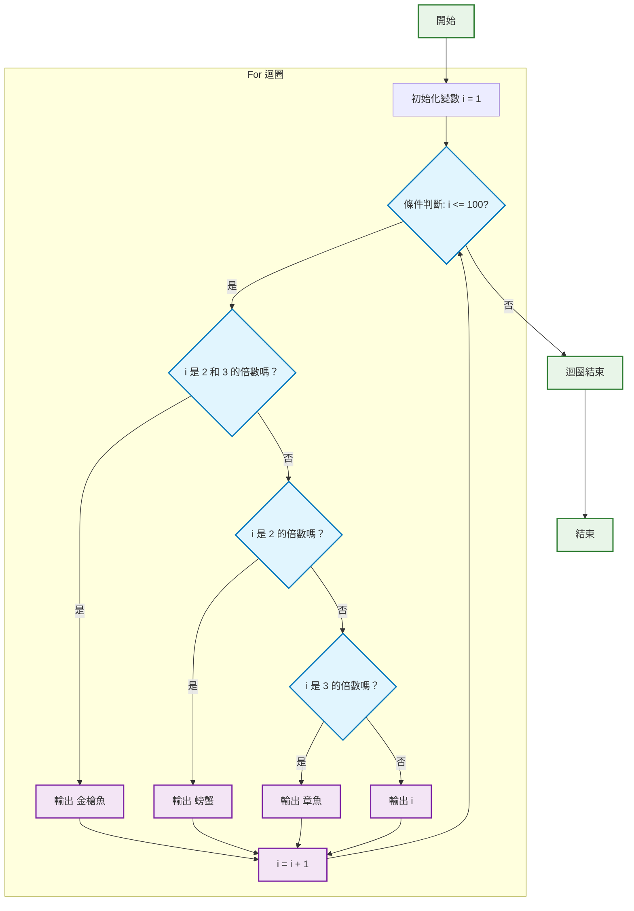

### 專案配### 題目說明

將 1~100 顯示在畫面上，如果遇到 2 的倍數則顯示"螃蟹"，如果遇到 3 的倍數則顯示"章魚"，如果同時為 2 跟 3 的倍數則顯示"金槍魚"。

### 程式流程圖

#### 範例輸出新增專案

- 目標方案名稱: StringReplace
- 專案名稱: StringReplace
- 專案類型: 主控台應用程式(.Net Framework)

### 題目說明

將 1~100 顯示在畫面上，如果遇到 2 的倍數則顯示”螃蟹”，如果遇到 3 的倍數則顯示”章魚”，如果同時為 2 跟 3 的倍數則顯示”金槍魚”。

#### 範例輸出

- 1: 1
- 2: 螃蟹
- 3: 章魚
- 4: 螃蟹
- 5: 5
- 6: 金槍魚
- 7: 7
- 8: 螃蟹
- 9: 章魚
- 10: 螃蟹
- 11: 11
- 12: 金槍魚
- 13: 13
- 14: 螃蟹
- 15: 金槍魚
- 16: 螃蟹
- 17: 17
- 18: 金槍魚
- 19: 19
- 20: 螃蟹
